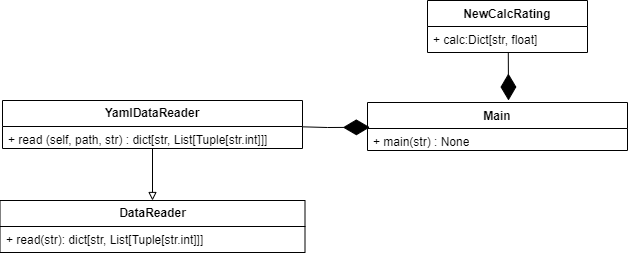

# Лабораторная работа 1 по дисциплине "Технологии программирования"

# Вариант 8

**Формат выходных значений**: YAML

**Расчетная процедура**: Определить и вывести на экран всех студентов, чей
рейтинг попадает во вторую квартиль распределения по рейтингам

# Технологии, используемые в приложении: 

**Язык программирования:** Python

**Тестирование:** Pytest

**Для работы с файлами в формате YAML используется библиотека:pyyaml**

**Диаграмма классов:**

# Выводы:
Разработано приложение согласно индивидуальному заданию, протестировано разработанное приложение с помощью pytest, все тесты были пройдены успешно.
